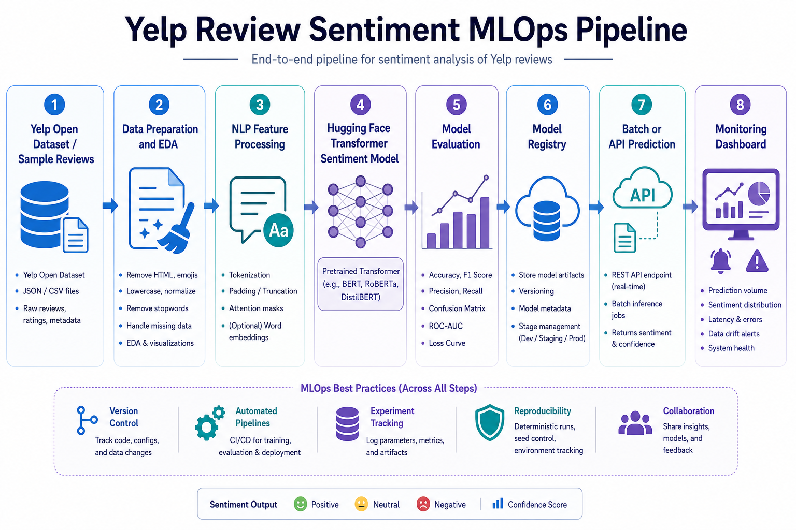

# Yelp Review Sentiment MLOps Pipeline



## Overview

This project builds an MLOps pipeline for analyzing Yelp customer reviews with natural language processing. The system classifies reviews as positive or negative, compares a baseline sentiment model with a transformer-based NLP model, evaluates model performance, and monitors changes in review data and prediction behavior over time.

The project is designed for the AAI-540 final project and connects data engineering, machine learning, model evaluation, deployment planning, and monitoring into one reproducible workflow.

## Problem Statement

Businesses receive large volumes of customer reviews, but manually reading and interpreting every review is difficult to scale. A sentiment classification system can help summarize customer satisfaction, identify negative experiences earlier, and monitor how customer feedback changes over time.

The model objective is to predict customer sentiment from review text. This is a supervised NLP classification problem because Yelp star ratings can be converted into sentiment labels:

- 4- and 5-star reviews are labeled `positive`
- 1- and 2-star reviews are labeled `negative`
- 3-star reviews are excluded from the first version because they are more neutral or ambiguous

## Data Source

The main data source is the [Yelp Open Dataset](https://business.yelp.com/data/resources/open-dataset/), which is intended for educational use and includes real-world Yelp data such as reviews, businesses, photos, check-ins, and business attributes. The review data provides the text and star ratings needed for sentiment classification.

The downloaded local files are:

```text
data/Yelp-JSON.zip
data/Yelp-Photos.zip
```

The sentiment pipeline uses `Yelp-JSON.zip`, which contains the Yelp review JSON data. `Yelp-Photos.zip` is kept for possible future multimodal analysis but is not part of the first text-classification model. The full Yelp files are large, so they are ignored by Git and should not be committed to GitHub.

Expected review fields:

- `review_text`: customer review text
- `stars`: Yelp star rating used to create the sentiment label

## Machine Learning Approach

The project will compare a simple baseline model against a more advanced NLP model:

- Baseline model: bag-of-words or TF-IDF style text features with a simple classifier
- Advanced model: Hugging Face transformer model such as DistilBERT or BERT
- Task type: supervised binary text classification
- Target labels: `positive` and `negative`

Evaluation metrics include accuracy, precision, recall, F1-score, and a confusion matrix. F1-score is especially important because the model should balance correctly identifying both positive and negative reviews.

## Exploratory Data Analysis

EDA is included because it helps determine whether the Yelp data is clean, balanced, and appropriate for modeling. Planned EDA includes:

- Review count and missing text checks
- Star rating distribution
- Positive vs negative class balance
- Average review length
- Common words and phrases by sentiment class
- Examples of ambiguous or difficult reviews

## MLOps Workflow

The planned workflow includes:

1. Ingest Yelp review data
2. Clean and prepare review text
3. Create sentiment labels from star ratings
4. Split data into train, validation, and test sets
5. Train a baseline sentiment classifier
6. Evaluate or fine-tune a Hugging Face transformer model
7. Compare model performance
8. Save model artifacts and reports
9. Run batch or API-based predictions
10. Monitor data quality, prediction distribution, review length drift, and model performance

## Project Structure

```text
.
├── README.md
├── requirements.txt
├── assets/
│   └── yelp_sentiment_mlops_architecture.png
├── data/
│   ├── README.md
│   ├── sample_yelp_reviews.csv
│   ├── Yelp-JSON.zip      # local only, ignored by Git
│   └── Yelp-Photos.zip    # local only, ignored by Git
├── src/
│   ├── prepare_data.py
│   ├── train.py
│   ├── evaluate.py
│   ├── evaluate_transformer.py
│   ├── predict.py
│   └── monitor.py
├── models/
└── reports/
```

## Running The Project

Run the local pipeline:

```bash
python3 -m src.run_pipeline
```

Run a single prediction:

```bash
python3 -m src.predict --text "The food was delicious and the service was fast."
```

Optional Hugging Face transformer evaluation:

```bash
pip install -r requirements.txt
python3 -m src.evaluate_transformer
```

## Monitoring Plan

The monitoring component will track:

- Missing or empty review text
- Review length changes over time
- Sentiment prediction distribution changes
- Model quality changes when labeled data is available
- Latency and resource usage for future deployment

## Final Deliverables

The final project will include:

- Data preparation workflow
- EDA summary and visualizations
- Baseline model
- Transformer-based NLP model comparison
- Model evaluation results
- Prediction workflow
- Monitoring plan or implementation
- Final design document and presentation

## Data Notice

The full Yelp Open Dataset should not be committed to this repository because of its size. The downloaded files `data/Yelp-JSON.zip` and `data/Yelp-Photos.zip` are intentionally ignored in `.gitignore`.
