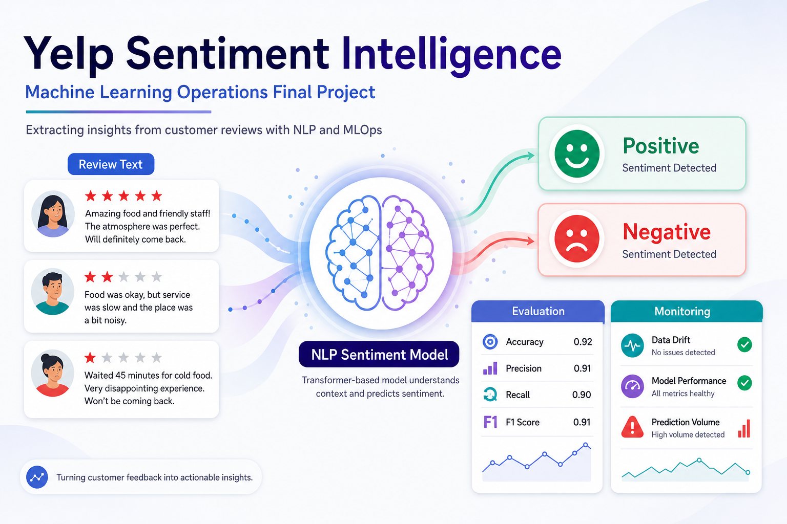

# Yelp Review Sentiment MLOps Pipeline



**Course:** AAI-540 Machine Learning Operations
**Business name:** Yelp Review Sentiment Intelligence

## Overview

This project builds a production-ready MLOps pipeline on AWS for classifying Yelp customer reviews as positive or negative. The pipeline follows the full ML lifecycle — data engineering, exploratory data analysis, feature engineering, model training, evaluation, deployment, CI/CD, and monitoring — using Amazon S3, AWS Glue/Athena, and Amazon SageMaker.

## Problem Statement

Businesses receive large volumes of customer reviews, but reading and interpreting every review manually does not scale. A sentiment classification system can help summarize customer satisfaction, identify negative experiences earlier, and monitor how customer feedback changes over time.

The model objective is to predict customer sentiment from review text. Yelp star ratings are converted into binary sentiment labels:

- 4- and 5-star reviews are labeled `positive`
- 1- and 2-star reviews are labeled `negative`
- 3-star reviews are excluded as neutral / ambiguous

## Data Source

The data source is the [Yelp Open Dataset](https://business.yelp.com/data/resources/open-dataset/), an educational dataset of approximately 6.99 million reviews, 150,346 businesses, and 200,100 photos across 11 metropolitan areas. The sentiment pipeline uses `Yelp-JSON.zip` (~4 GB compressed). The photo archive is out of scope for this version.

Fields used:

- `review_text` — customer review text
- `stars` — Yelp star rating used to create the sentiment label

The full Yelp archive is too large for GitHub, so it lives in Amazon S3 (`s3://<bucket>/raw/yelp-json.zip`) and is referenced from the notebooks.

## Machine Learning Approach

- **Benchmark:** majority-class baseline (macro F1 0.3333) to establish a floor.
- **Production model:** TF-IDF + Logistic Regression, trained as a SageMaker SKLearn training job.
- **Task type:** supervised binary text classification
- **Target labels:** `positive`, `negative`
- **Evaluation metrics:** accuracy, precision, recall, F1-score (macro), confusion matrix. Macro F1 is the primary gate metric because both classes matter.
- **Results:** the trained model reaches macro F1 0.9408 on the held-out test split, and an improved-hyperparameter version reaches 0.9446 through the CI/CD pipeline (both above the 0.80 quality gate).

## AWS MLOps Architecture


| Layer | Service |
|---|---|
| Raw and processed storage | Amazon S3 |
| Data catalog and SQL query | AWS Glue Catalog + Amazon Athena |
| Preprocessing and EDA | Amazon SageMaker Studio notebooks |
| Feature management | Amazon SageMaker Feature Store (offline store on S3, queryable via Athena) |
| Model training | SageMaker SKLearn Training Job |
| Model versioning | SageMaker Model Registry (`yelp-sentiment-models`) |
| Pipeline orchestration / CI-CD DAG | SageMaker Pipelines (with `ConditionStep` quality gate and `FailStep`) |
| Batch scoring | SageMaker Batch Transform |
| Data and model monitoring | Custom batch monitors + Amazon CloudWatch dashboard and alarms |

See `docs/aws_mlops_plan.md` for the full implementation plan and S3 layout.

## Project Structure

```text
.
├── README.md
├── requirements.txt
├── LICENSE
├── assets/
│   ├── yelp_sentiment_project_overview.png
│   └── yelp_sentiment_mlops_architecture.png
├── data/
│   ├── README.md
│   ├── sample_yelp_reviews.csv
│   └── Yelp-JSON.zip            # local only, ignored by Git, uploaded to S3 once
├── notebooks/
│   ├── 01_setup_S3_bucket.ipynb
│   ├── 02_data_exploration_EDA.ipynb
│   ├── 03_feature_engineering_feature_store.ipynb
│   ├── 04_dataset_splits.ipynb
│   ├── 05_model_training_evaluation_deployment.ipynb
│   ├── 06_model_data_infrastructure_monitoring.ipynb
│   ├── 07_cicd_sagemaker_pipeline.ipynb
│   └── plot_style.py
├── athena_queries/
│   ├── 01_Create_Athena_Database.ipynb
│   ├── 02_Register_S3_With_Athena.ipynb
│   └── 03_Convert_CSV_To_Parquet_With_Athena.ipynb
├── src/
│   ├── preprocessing.py          # SageMaker Pipeline preprocessing/validation step
│   ├── train_sklearn.py          # TF-IDF + Logistic Regression training entry point
│   ├── evaluation.py             # SageMaker Pipeline evaluation step (quality gate input)
│   └── inference.py              # Batch Transform inference handlers
├── docs/
│   ├── aws_mlops_plan.md
│   └── week_progress.md
├── models/                       # model binaries are stored in S3, not Git
└── reports/                      # EDA charts, evaluation metrics, monitoring + CI/CD reports
```

## Running the Project

### 1. One-time upload from your laptop

The full Yelp archive is uploaded to S3 once. The bucket name is `yelp-sentiment-mlops-<your-aws-account-id>` (the setup notebook prints it):

```bash
aws s3 cp data/Yelp-JSON.zip s3://yelp-sentiment-mlops-<account-id>/raw/yelp-json.zip
```

### 2. Clone in SageMaker Studio

```bash
git clone https://github.com/marwahfaraj/yelp-sentiment-mlops-pipeline.git
cd yelp-sentiment-mlops-pipeline
pip install -r requirements.txt
```

### 3. Run the notebooks in order

Each notebook persists its variables with `%store` so the next notebook can pick them up automatically.

| Step | Notebook                                                     | Module deliverable                            |
|------|--------------------------------------------------------------|-----------------------------------------------|
| 1    | `notebooks/01_setup_S3_bucket.ipynb`                         | Raw Yelp data lake in S3                      |
| 2    | `athena_queries/01_Create_Athena_Database.ipynb`             | `yelp_db` Athena database                     |
| 3    | `athena_queries/02_Register_S3_With_Athena.ipynb`            | `yelp_db.reviews_raw` external table          |
| 4    | `athena_queries/03_Convert_CSV_To_Parquet_With_Athena.ipynb` | `yelp_db.reviews_parquet` (Snappy Parquet)    |
| 5    | `notebooks/02_data_exploration_EDA.ipynb`                    | EDA charts in `reports/`                      |
| 6    | `notebooks/03_feature_engineering_feature_store.ipynb`       | SageMaker Feature Group + 40/10/10/40 splits  |
| 7    | `notebooks/04_dataset_splits.ipynb`                          | Verified splits + rubric class-balance check  |
| 8    | `notebooks/05_model_training_evaluation_deployment.ipynb`    | Benchmark, SageMaker training, evaluation, Batch Transform deployment |
| 9    | `notebooks/06_model_data_infrastructure_monitoring.ipynb`    | Model/data/infrastructure monitors + CloudWatch dashboard and alarms |
| 10   | `notebooks/07_cicd_sagemaker_pipeline.ipynb`                 | CI/CD SageMaker Pipeline, quality gate, Model Registry, batch deployment |

Notebooks 01–06 only need to be rerun if the upstream S3 data changes. Notebook 07 reads the
existing splits from S3 and runs the full CI/CD pipeline on its own.

## Dataset Splits

| Split        | Share | Purpose                                              |
|--------------|------:|------------------------------------------------------|
| `train`      |  40%  | Model fitting                                        |
| `validation` |  10%  | Hyperparameter tuning and Pipeline ConditionStep gate |
| `test`       |  10%  | Final holdout evaluation                              |
| `production` |  40%  | Reserved unlabeled-style data for batch inference and monitoring drift simulations |

Splits are stratified by `sentiment_label`, persisted as `split_type` in the Feature Group, and materialized to `s3://<bucket>/processed/splits/{train,validation,test,production}/`.

## CI/CD Pipeline

`notebooks/07_cicd_sagemaker_pipeline.ipynb` defines and runs a SageMaker Pipeline that automates the full workflow:

```text
YelpPreprocess -> YelpTrain -> YelpEvaluate -> YelpF1Gate -> (Register + CreateModel + BatchTransform) or FailStep
```

The `ConditionStep` quality gate requires:

```text
macro F1-score (test) >= 0.80
```

Models that pass are registered to the SageMaker Model Registry (`yelp-sentiment-models`) and deployed via Batch Transform; models that fail route to a `FailStep` that blocks deployment. The pipeline was run twice — a baseline model (macro F1 0.9408) and an improved-hyperparameter model (macro F1 0.9446) — both through the same checkpoints. Results are captured in `reports/cicd_pipeline_summary.md`.

## Monitoring

`notebooks/06_model_data_infrastructure_monitoring.ipynb` implements monitoring for the batch workflow and publishes custom metrics, alarms, and a CloudWatch dashboard (`yelp-sentiment-week5-monitoring`):

- **Data monitors:** missing/empty review text, review-length drift, and class-distribution drift versus the training baseline.
- **Model monitors:** test-set macro F1 quality gate and batch prediction distribution drift.
- **Bias & explainability:** class-balance comparison and a TF-IDF token-frequency drift proxy.
- **Infrastructure monitors:** SageMaker training and Batch Transform job health.

Monitoring outputs are saved under `reports/` (see `week5_monitoring_report.md`, the `*_monitoring_summary.json` files, and the dashboard PNGs).

## Security & Privacy

- No PHI or credit card data is processed.
- Yelp records include user and business identifiers; raw user-level records are never published in reports.
- All data is stored in account-owned S3 with IAM-controlled access.
- Reviews may contain biased or culturally specific language; class-balance bias and a token-drift explainability proxy are tracked in the monitoring notebook (SageMaker Clarify/SHAP can replace this proxy for a future transformer model).

## Final Deliverables

- ML System Design Document (submitted separately by the team)
- AWS-native codebase in this repository
- 10-15 minute video demonstration of the running system

## Data Notice

`data/Yelp-JSON.zip` is local-only and intentionally excluded from Git. The authoritative copy lives in S3.
